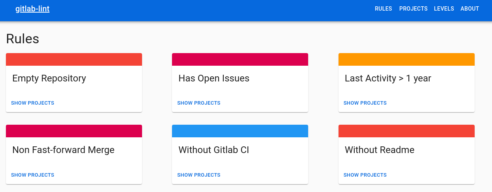

# gitlab-lint Frontend



## Dependencies

- NodeJS v12+
- Yarn v1.22+
- [gitlab-lint API and Collector][gitlab-lint]

### Installing dependencies

```bash
make setup
```

## Running project

```bash
make run
```

[gitlab-lint]: https://github.com/globocom/gitlab-lint
